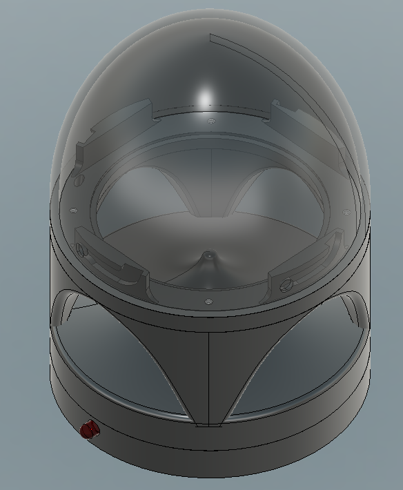
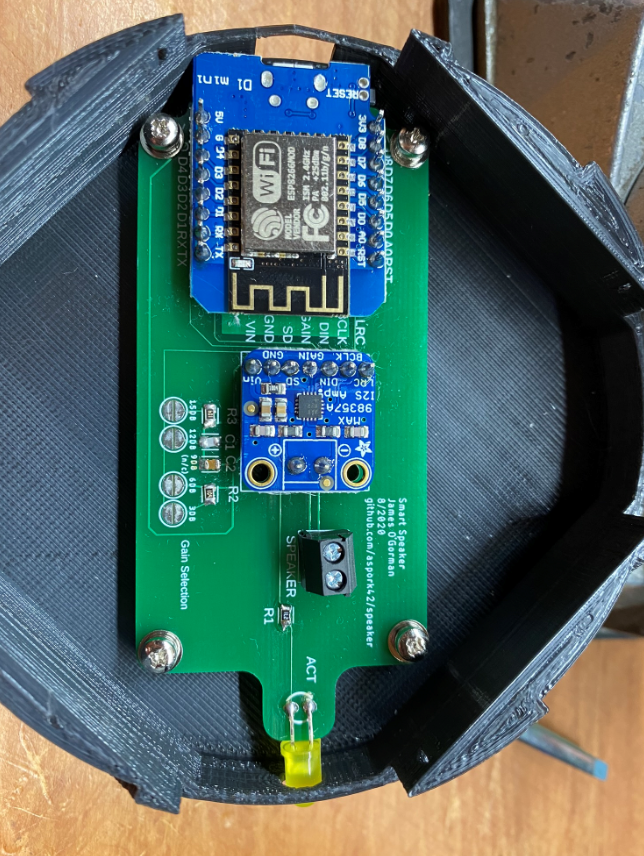
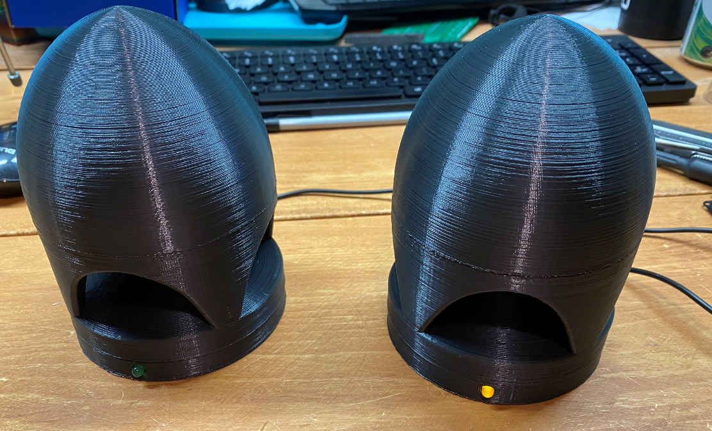

# Smart Speaker
Smart Speaker for DIY Home Automation 

This is based on software by Mr DIY's "Notifier" project. I have modified it to include a status LED and created a PCB and enclosure for a 3" speaker.

This can be used to play a sound when doors are opened, faucets are left running, water is found flooding the basement or to play nursery rhymes in the kids room at night.

This uses a D1 Mini WIFI module, an Adafruit MAX 98357A I2S Audio DAC & amplifier, and a custom PCB.

Most of the base software is from Mr. DIY and all the write-ups can be found on his GitLab page: https://gitlab.com/MrDIYca/mrdiy-audio-notifier

STP files are located on Thingiverse: https://www.thingiverse.com/thing:4590242

Finished product:

Speaker:https://www.adafruit.com/product/1314

I2S DAC/Amplifier: https://www.adafruit.com/product/3006

PCB can be ordered from the Gerbers attached in the zip file.

